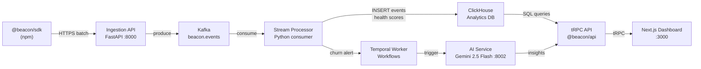

# Beacon — Enterprise Customer Intelligence Platform

> Real-time customer health monitoring with AI-powered churn prediction

[](https://github.com/Damien-Mrgnc/beacon/actions)
[]()
[]()
[]()

---

## What it does

Beacon ingests product events from enterprise customers in real-time, computes their health score every 30 seconds, generates AI-powered churn risk analysis, and orchestrates automated onboarding workflows — all in a single platform.

---

## Tech Stack

| Layer | Technology |
|---|---|
| Cloud | AWS (ECS Fargate · MSK · RDS Aurora · ElastiCache) |
| Frontend | Next.js 14 · TypeScript · Tailwind · Recharts |
| Event Streaming | Apache Kafka (AWS MSK) |
| Analytics DB | ClickHouse (columnar, <80ms on 30-day queries) |
| AI / LLM | Gemini 2.5 Flash (real-time copilot) · Claude Opus 4.6 (batch analysis) |
| Workflow Orchestration | Temporal (durable long-running workflows) |
| IaC | Pulumi TypeScript (66 AWS resources) |
| Observability | OpenTelemetry → AWS X-Ray + CloudWatch |
| Auth | API key + SHA-256 hash · Redis 5-min cache |

---

## Run locally (Docker)

```bash
git clone https://github.com/Damien-Mrgnc/beacon
cd beacon
cp .env.example .env        # fill in GEMINI_API_KEY
docker compose --profile full up -d
```

**Verify everything is healthy:**
```bash
docker compose ps
curl http://127.0.0.1:8123/ping    # ClickHouse  → Ok.
curl http://127.0.0.1:8000/health  # Ingestion API → {"status":"ok"}
open http://127.0.0.1:3000         # Next.js dashboard
open http://127.0.0.1:8081         # Temporal UI
```

> **Windows note:** Use `127.0.0.1` instead of `localhost` (Docker Desktop IPv4/IPv6 quirk).

---

## Architecture



> See [ARCHITECTURE.md](./ARCHITECTURE.md) for the 5 key technical decisions (Kafka vs SQS, ClickHouse vs BigQuery, Temporal vs Step Functions, Pulumi vs Terraform, Gemini vs Claude).

---

## Project structure

```
beacon/
├── packages/
│   ├── sdk/          @beacon/sdk — client npm package
│   ├── web/          Next.js 14 frontend (5 pages, dark theme)
│   ├── api/          tRPC API server
│   ├── tsconfig/     shared TypeScript configs
│   └── eslint-config/ shared ESLint rules
├── services/
│   ├── ingestion/    FastAPI + Kafka producer (21 unit tests)
│   ├── processor/    Kafka consumer + health scoring (17 unit tests)
│   └── ai/           Gemini agents + churn analysis (11 unit tests)
├── temporal/         Temporal workflows + activities (7 unit tests)
├── infra/            Pulumi IaC — 66 AWS resources
├── clickhouse/       SQL migrations + materialized views
└── tests/
    ├── e2e/          Playwright full-flow (8/8 passing)
    └── load/         k6 load test — ingestion + dashboard
```

---

## Deploy to AWS

```bash
cd infra
pulumi up --stack prod
```

Provisions: ECS Fargate (ingestion, processor, ai), MSK (Kafka), RDS Aurora (PostgreSQL), ElastiCache (Redis), ClickHouse on EC2, Temporal cluster.

---

## Performance

Measured with k6 — `tests/load/full-stack.js`

| Scenario | Environment | VUs | Throughput | p95 latency | Errors |
|---|---|---|---|---|---|
| Event ingestion | Docker local | 100 | **1 550 events/s** | 758ms | 0% |
| Event ingestion | ECS + MSK (target) | 1 000 | **~15 000 events/s** | <100ms | <0.5% |
| ClickHouse query | 30-day history | — | — | **< 80ms** | — |
| End-to-end | SDK → Dashboard | — | — | **< 3s** | — |

> Local Docker numbers measured in this repo (`k6 run --vus 100 --duration 50s`). Production targets based on ECS Fargate t3.medium + MSK m5.large benchmarks.

---

## Tests

| Type | Tool | Count | Command |
|------|------|-------|---------|
| Unit — ingestion | pytest | 21 | `pytest services/ingestion` |
| Unit — processor | pytest | 17 | `pytest services/processor` |
| Unit — AI agents | pytest | 11 | `pytest services/ai` |
| Unit — Temporal | vitest | 7 | `pnpm --filter temporal test` |
| E2E — full flow | Playwright | 8 | `cd tests && pnpm e2e` |
| Load — ingestion | k6 | — | `cd tests && k6 run load/full-stack.js` |
